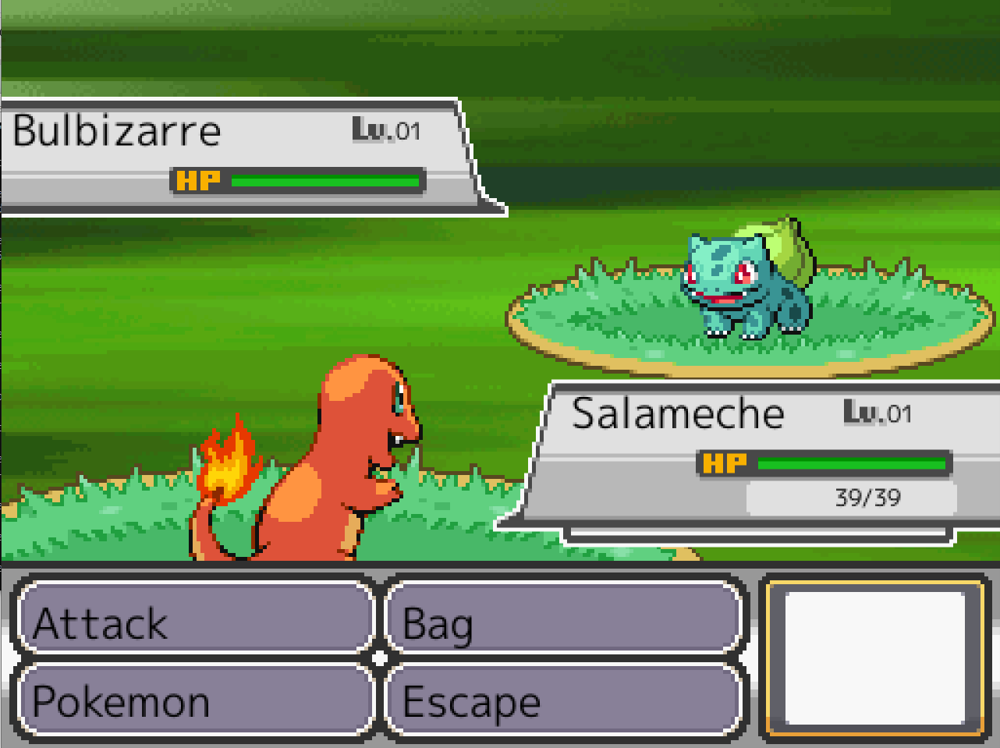

# Pokemon Ymmersion 22

Pokemon Ymmersion 22

## Installation For Play

download the zip on [Itchio](https://tot0p.itch.io/pokemongo) with password in mdp.txt and unzip with password in mdp.txt in the directory where you want install Pokemon Ymmersion 22
and click on exe for start the game.

## Settings

To put in full screen, it is necessary to set fs at true in data/setting.json

## Installation For Contributing

For Contributing you need [ebiten](https://ebiten.org/) and [text](https://pkg.go.dev/golang.org/x/text)

## Screenshots

